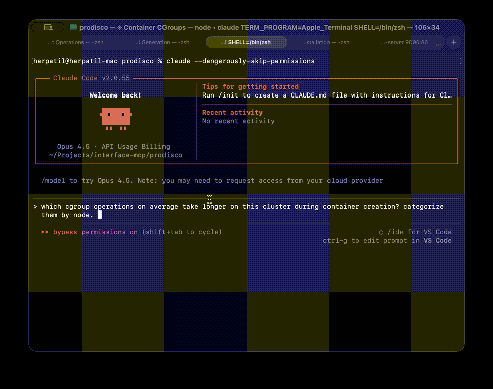

# ProDisco (Progressive Disclosure Kubernetes MCP Server)

ProDisco gives AI agents **Kubernetes access + Prometheus metrics analysis** through a single unified search tool. It follows Anthropic's [Progressive Disclosure](https://www.anthropic.com/engineering/code-execution-with-mcp) pattern: the MCP server exposes search tools which surface TypeScript modules, agents discover them to write code, and only the final console output returns to the agent.

**One tool, two domains:**
- **Kubernetes Operations** - Discover API methods from `@kubernetes/client-node` to manage pods, deployments, services, and more
- **Prometheus Metrics** - Discover methods from `prometheus-query` for PromQL queries and metrics analysis

## Why Progressive Disclosure Matters

Anthropic's latest guidance explains why MCP servers should progressively reveal capabilities instead of dumping every tool definition into the model context. When agents explore a filesystem of TypeScript modules, they only load what they need and process data inside the execution environment, then return a concise result to the chat. This keeps token usage low, improves latency, and avoids copying large intermediate payloads through the model ([source](https://www.anthropic.com/engineering/code-execution-with-mcp)).

ProDisco goes a step further: instead of exposing custom TypeScript modules, it provides a structured parameter search tool that dynamically extracts methods from upstream libraries using TypeScript AST parsing. This means:
- **Zero maintenance** - Methods are extracted directly from library `.d.ts` files
- **Always current** - Upgrading a dependency automatically exposes new methods
- **Type-safe** - Full parameter types and return types included


---

## Demo

### Kubernetes Operations


### Prometheus Queries


---

## Quick Start

### Add to Claude Code

Add ProDisco to Claude Code with a single command:

```bash
claude mcp add ProDisco --env KUBECONFIG="${HOME}/.kube/config" -- npx -y @prodisco/k8s-mcp
```

**With Prometheus (optional):**
```bash
claude mcp add ProDisco \
  --env KUBECONFIG="${HOME}/.kube/config" \
  --env PROMETHEUS_URL="http://localhost:9090" \
  -- npx -y @prodisco/k8s-mcp
```

Remove if needed:
```bash
claude mcp remove ProDisco
```

**Environment variables:**
| Variable | Required | Description |
|----------|----------|-------------|
| `KUBECONFIG` | No | Path to kubeconfig (defaults to `~/.kube/config`) |
| `K8S_CONTEXT` | No | Kubernetes context (defaults to current context) |
| `PROMETHEUS_URL` | No | Prometheus server URL for metrics queries |

> **Important:** These environment variables must be set where the AI agent runs, not just where the MCP server runs. This is because ProDisco follows the progressive disclosure pattern, the agent discovers API methods, writes TypeScript code, and executes it locally to probe your cluster. The agent's execution environment needs access to your kubeconfig and/or Prometheus endpoint.

> **Tip:** If you're using a kind cluster for local testing, you can port-forward to Prometheus:
> ```bash
> kubectl port-forward -n monitoring svc/prometheus-server 9090:80
> ```
> Then set `PROMETHEUS_URL="http://localhost:9090"`

### Development Setup

For local development:

```bash
git clone https://github.com/harche/ProDisco.git
cd ProDisco
npm install
npm run build
claude mcp add --transport stdio prodisco -- node dist/server.js
claude mcp remove prodisco # remove when you're done
```

### Scripts cache convention

**Script Location:** `~/.prodisco/scripts/cache/`

ProDisco automatically creates a `~/.prodisco/scripts/cache/` directory in your home directory for storing helper scripts. This ensures scripts work from any directory and persist across sessions.

---

## Available Tools

ProDisco exposes a single unified tool with four modes:

| Mode | Purpose | Example |
|------|---------|---------|
| `methods` | Find Kubernetes API methods | `{ resourceType: "Pod", action: "list" }` |
| `types` | Get TypeScript type definitions | `{ mode: "types", types: ["V1Pod.spec"] }` |
| `scripts` | Search cached scripts | `{ mode: "scripts", searchTerm: "logs" }` |
| `prometheus` | Find Prometheus API methods | `{ mode: "prometheus", category: "query" }` |

For comprehensive documentation including architecture details and example workflows, see [docs/search-tools.md](docs/search-tools.md).

### kubernetes.searchTools

A unified search interface for Kubernetes operations and metrics analysis.

**Input:**
```typescript
{
  // Mode selection
  mode?: 'methods' | 'types' | 'scripts' | 'prometheus';  // default: 'methods'

  // Methods mode - Kubernetes API discovery
  resourceType?: string;  // e.g., "Pod", "Deployment", "Service"
  action?: string;        // e.g., "list", "read", "create", "delete", "patch"
  scope?: 'namespaced' | 'cluster' | 'all';
  exclude?: { actions?: string[]; apiClasses?: string[] };

  // Types mode - TypeScript definitions
  types?: string[];       // e.g., ["V1Pod", "V1Deployment.spec"]
  depth?: number;         // Nested type depth (1-2)

  // Scripts mode - Cached script discovery
  searchTerm?: string;    // Search term (omit to list all)

  // Prometheus mode - Prometheus API discovery and metrics
  category?: 'query' | 'metadata' | 'alerts' | 'metrics' | 'all';
  methodPattern?: string; // e.g., "query", "labels", "pod", "gpu"

  // Shared parameters
  limit?: number;         // Max results (default: 10)
  offset?: number;        // Pagination offset
}
```

**Methods Mode Examples:**
```typescript
// List all Pod-related methods
{ resourceType: "Pod" }

// List namespaced Pods
{ resourceType: "Pod", action: "list", scope: "namespaced" }

// Create Deployment
{ resourceType: "Deployment", action: "create" }

// Pod methods excluding delete actions
{ resourceType: "Pod", exclude: { actions: ["delete"] } }

// Pod methods excluding CoreV1Api (shows only PolicyV1Api, AutoscalingV1Api, etc.)
{ resourceType: "Pod", exclude: { apiClasses: ["CoreV1Api"] } }
```

**Types Mode Examples:**
```typescript
// Get V1Pod type definition
{ mode: "types", types: ["V1Pod"] }

// Get multiple types
{ mode: "types", types: ["V1Pod", "V1Deployment", "V1Service"] }

// Navigate to nested types using dot notation
{ mode: "types", types: ["V1Deployment.spec"] }  // Returns V1DeploymentSpec
{ mode: "types", types: ["V1Pod.spec.containers"] }  // Returns V1Container (array element)
{ mode: "types", types: ["V1Pod.status.conditions"] }  // Returns V1PodCondition

// Include nested types at depth 2
{ mode: "types", types: ["V1Pod"], depth: 2 }
```

**Scripts Mode Examples:**
```typescript
// List all cached scripts
{ mode: "scripts" }

// Search for pod-related scripts
{ mode: "scripts", searchTerm: "pod" }
```

**Prometheus Mode Examples:**
```typescript
// List all available methods
{ mode: "prometheus" }

// Find PromQL query methods
{ mode: "prometheus", category: "query" }

// Find metadata methods (labels, series, targets)
{ mode: "prometheus", category: "metadata" }

// Search for specific methods
{ mode: "prometheus", methodPattern: "query" }

// Discover actual metrics from your cluster
{ mode: "prometheus", category: "metrics", methodPattern: "pod" }

// Find GPU metrics
{ mode: "prometheus", category: "metrics", methodPattern: "gpu" }
```

**Available Categories (Prometheus Mode):**

| Category | Methods | Use Case |
|----------|---------|----------|
| `query` | `instantQuery`, `rangeQuery` | Execute PromQL queries |
| `metadata` | `series`, `labelNames`, `labelValues`, `targets` | Explore metrics metadata |
| `alerts` | `rules`, `alerts`, `alertmanagers` | Access alerting information |
| `metrics` | (dynamic from cluster) | Discover actual metrics with descriptions |

---

## Integration Tests

End-to-end testing instructions (KIND cluster + Claude Agent SDK driver) now live in `docs/integration-testing.md`. The workflow is manual-only for now and assumes your Anthropic credentials are already configured. Run it locally with:

```bash
npm run test:integration
```

---

## License

MIT

