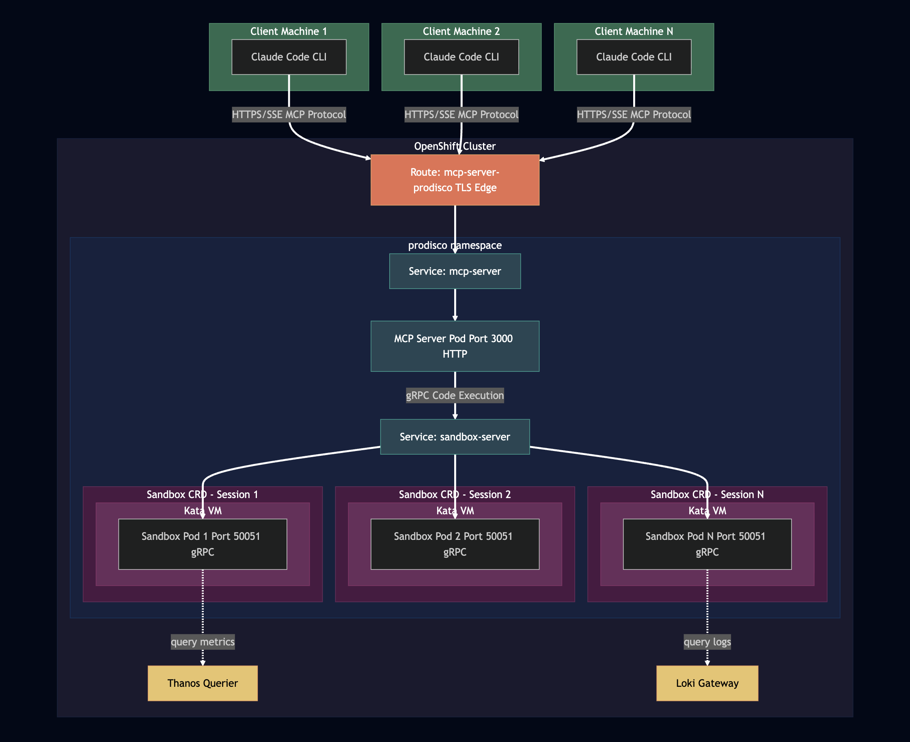

# gRPC Sandbox Architecture

This document describes the gRPC-based sandbox execution architecture used in ProDisco. The design decouples code execution from the MCP server, enabling flexible deployment options and improved isolation.

---

## Table of Contents

- [Overview](#overview)
- [Key Design Decisions](#key-design-decisions)
- [Directory Structure](#directory-structure)
- [Protocol Definition](#protocol-definition)
  - [Service Definition](#service-definition)
  - [Execution Modes](#execution-modes)
  - [Core Messages](#core-messages)
  - [Execution State](#execution-state)
  - [Streaming Messages](#streaming-messages)
  - [Async Execution Messages](#async-execution-messages)
- [Component Details](#component-details)
  - [MCP Server](#mcp-server)
  - [runSandbox Tool](#runsandbox-tool)
  - [gRPC Client](#grpc-client)
  - [gRPC Server](#grpc-server)
  - [Executor](#executor)
  - [Execution Registry](#execution-registry)
  - [Cache Manager](#cache-manager)
- [Execution Flows](#execution-flows)
  - [New Code Execution](#1-new-code-execution)
  - [Cached Script Execution](#2-cached-script-execution)
  - [Streaming Execution](#3-streaming-execution)
  - [Async Execution with Polling](#4-async-execution-with-polling)
  - [Execution Cancellation](#5-execution-cancellation)
  - [Test Execution](#6-test-execution)
- [Error Handling](#error-handling)
- [Configuration](#configuration)
  - [Transport Configuration](#transport-configuration)
  - [Security Configuration](#security-configuration)
  - [Application Configuration](#application-configuration)
- [TCP Transport](#tcp-transport)
  - [Server Configuration](#server-configuration)
  - [Client Configuration](#client-configuration)
  - [Choosing Between Unix Socket and TCP](#choosing-between-unix-socket-and-tcp)
- [Container Isolation](#container-isolation)
  - [Building and Deploying](#building-and-deploying)
  - [Connecting to Containerized Sandbox](#connecting-to-containerized-sandbox)
- [Transport Security](#transport-security)
  - [Security Modes](#security-modes)
  - [TLS Configuration](#tls-configuration)
  - [Certificate Management with cert-manager](#certificate-management-with-cert-manager)
  - [Kubernetes Deployment with TLS](#kubernetes-deployment-with-tls)
- [Testing](#testing)
- [Future Enhancements](#future-enhancements)

---

## Overview

The sandbox system follows a client-server model with per-session isolation. Each MCP client session gets its own Sandbox CRD, which provisions a dedicated pod and service:



---

## Key Design Decisions

### 1. Kubernetes-Aware Server

The gRPC sandbox server has Kubernetes and Prometheus context baked in:

- Loads `KubeConfig` from the environment at startup
- Provides pre-configured `k8s` module and `kc` (KubeConfig instance)
- Supports `require("prometheus-query")` for metrics queries

### 2. In-Repo but Extractable

The sandbox server lives in `packages/sandbox-server/` as an npm workspace package. This allows:

- Easy development and testing alongside the MCP server
- Future extraction to a separate repository if needed
- Independent versioning and deployment

### 3. Flexible Transport: Unix Socket or TCP

Communication supports both Unix domain sockets and TCP:

**Unix Socket (default)** - Best for local execution:
- Low latency
- Simple setup with no network configuration
- Secure by default (file system permissions)

**TCP Transport** - Enables remote execution:
- Connect to sandbox servers on different hosts
- Suitable for containerized deployments
- Configurable via options or environment variables

### 4. Language-Agnostic Protocol

The gRPC protocol is designed to be language-agnostic:

- `Execute` RPC accepts generic "code" (not TypeScript-specific)
- Different server implementations could execute Go, Python, etc.
- The protocol focuses on execution semantics, not language details

---

## Directory Structure

```
packages/sandbox-server/
├── proto/
│   └── sandbox.proto              # gRPC service definition
├── src/
│   ├── generated/                 # Auto-generated TypeScript from proto
│   │   └── sandbox.ts
│   ├── server/
│   │   ├── index.ts               # Server entry point
│   │   ├── sandbox-service.ts     # gRPC service implementation
│   │   ├── executor.ts            # VM execution logic
│   │   ├── execution-registry.ts  # Async execution state management
│   │   └── cache-manager.ts       # Script caching with deduplication
│   ├── client/
│   │   └── index.ts               # gRPC client wrapper
│   └── __tests__/                 # Test files
│       ├── integration.test.ts
│       ├── streaming-execution.test.ts
│       ├── async-execution.test.ts
│       ├── execution-registry.test.ts
│       ├── cache-manager.test.ts
│       └── cluster-integration.test.ts
├── package.json
├── tsconfig.json
└── buf.gen.yaml                   # Proto code generation config
```

---

## Protocol Definition

### Service Definition

The gRPC service is defined in `proto/sandbox.proto`:

```protobuf
syntax = "proto3";

package prodisco.sandbox.v1;

service SandboxService {
  // Synchronous execution (blocks until complete)
  rpc Execute(ExecuteRequest) returns (ExecuteResponse);

  // Streaming execution (real-time output)
  rpc ExecuteStream(ExecuteRequest) returns (stream ExecuteChunk);

  // Async execution (fire-and-forget with polling)
  rpc ExecuteAsync(ExecuteRequest) returns (ExecuteAsyncResponse);
  rpc GetExecution(GetExecutionRequest) returns (GetExecutionResponse);
  rpc CancelExecution(CancelExecutionRequest) returns (CancelExecutionResponse);
  rpc ListExecutions(ListExecutionsRequest) returns (ListExecutionsResponse);

  // Test execution (unit testing with structured results)
  rpc ExecuteTest(ExecuteTestRequest) returns (ExecuteTestResponse);

  // Health and cache management
  rpc HealthCheck(HealthCheckRequest) returns (HealthCheckResponse);
  rpc ListCache(ListCacheRequest) returns (ListCacheResponse);
  rpc ClearCache(ClearCacheRequest) returns (ClearCacheResponse);
}
```

### Execution Modes

The API supports three execution modes for different use cases:

| Mode | RPC | Use Case |
|------|-----|----------|
| **Synchronous** | `Execute` | Simple scripts, short execution time |
| **Streaming** | `ExecuteStream` | Real-time output display, long-running scripts |
| **Async** | `ExecuteAsync` + polling | Background execution, cancellation support |
| **Test** | `ExecuteTest` | Unit testing with structured results |

### Core Messages

```protobuf
message ExecuteRequest {
  oneof source {
    string code = 1;        // Code to execute
    string cached = 2;      // Name of cached script to run
  }
  optional int32 timeout_ms = 3;
}

message ExecuteResponse {
  bool success = 1;
  string output = 2;
  optional string error = 3;
  int64 execution_time_ms = 4;
  optional CacheEntry cached = 5;  // Set if newly cached
}

message CacheEntry {
  string name = 1;           // e.g., "script-2024-01-15T10-30-00-abc123def456.ts"
  string description = 2;    // Extracted from code comments
  int64 created_at_ms = 3;
  string content_hash = 4;   // For deduplication
}
```

### Execution State

Async and streaming executions track state through their lifecycle:

```protobuf
enum ExecutionState {
  EXECUTION_STATE_UNSPECIFIED = 0;
  EXECUTION_STATE_PENDING = 1;     // Queued, waiting to run
  EXECUTION_STATE_RUNNING = 2;     // Currently executing
  EXECUTION_STATE_COMPLETED = 3;   // Finished successfully
  EXECUTION_STATE_FAILED = 4;      // Finished with error
  EXECUTION_STATE_CANCELLED = 5;   // Cancelled by user
  EXECUTION_STATE_TIMEOUT = 6;     // Exceeded time limit
}
```

### Streaming Messages

```protobuf
message ExecuteChunk {
  string execution_id = 1;
  oneof chunk {
    string output = 2;           // stdout/console.log
    string error_output = 3;     // stderr/console.error
    ExecuteResult result = 4;    // Final result (last chunk)
  }
  int64 timestamp_ms = 5;
}

message ExecuteResult {
  bool success = 1;
  optional string error = 2;
  int64 execution_time_ms = 3;
  ExecutionState state = 4;
  optional CacheEntry cached = 5;
}
```

### Async Execution Messages

```protobuf
message ExecuteAsyncResponse {
  string execution_id = 1;    // UUID for tracking
  ExecutionState state = 2;   // Initial state (PENDING or RUNNING)
}

message GetExecutionRequest {
  string execution_id = 1;
  bool wait = 2;              // Long-poll until completion
  int64 output_offset = 3;    // For incremental output reads
}

message GetExecutionResponse {
  string execution_id = 1;
  ExecutionState state = 2;
  string output = 3;              // Buffered stdout since offset
  string error_output = 4;        // Buffered stderr since offset
  int64 output_length = 5;        // Total output length (for next offset)
  int64 error_output_length = 6;
  optional ExecuteResult result = 7;  // Set when in terminal state
}

message CancelExecutionRequest {
  string execution_id = 1;
}

message CancelExecutionResponse {
  bool success = 1;
  ExecutionState state = 2;
  optional string message = 3;    // Error message if cancellation failed
}

message ListExecutionsRequest {
  repeated ExecutionState states = 1;  // Filter by state (empty = all)
  int32 limit = 2;
  int64 include_completed_within_ms = 3;  // Include recent completions
}

message ListExecutionsResponse {
  repeated ExecutionInfo executions = 1;
}

message ExecutionInfo {
  string execution_id = 1;
  ExecutionState state = 2;
  int64 started_at_ms = 3;
  optional int64 finished_at_ms = 4;
  string code_preview = 5;        // First 100 chars
  bool is_cached = 6;
  optional string cached_name = 7;
}
```

### Test Execution Messages

```protobuf
message ExecuteTestRequest {
  optional string code = 1;       // Implementation code to test
  string tests = 2;               // Test code using uvu assertions
  optional int32 timeout_ms = 3;
}

message ExecuteTestResponse {
  bool success = 1;               // True if all tests passed
  TestSummary summary = 2;
  repeated TestResult tests = 3;
  string output = 4;              // Console output from tests
  int64 execution_time_ms = 5;
  optional string error = 6;      // Error if execution failed before tests ran
}

message TestSummary {
  int32 total = 1;
  int32 passed = 2;
  int32 failed = 3;
  int32 skipped = 4;
}

message TestResult {
  string name = 1;
  bool passed = 2;
  optional string error = 3;      // Assertion error message if failed
  int64 duration_ms = 4;
}
```

**Note:** The `uvu` testing framework is automatically available in test mode. Do not import it - `test()` and `assert` are pre-injected globals.

---

## Component Details

### MCP Server

The MCP server spawns the sandbox server as a subprocess on startup:

```typescript
async function startSandboxServer(): Promise<void> {
  const sandboxServerPath = path.resolve(__dirname, '../packages/sandbox-server/dist/server/index.js');
  const socketPath = process.env.SANDBOX_SOCKET_PATH || '/tmp/prodisco-sandbox.sock';

  sandboxProcess = spawn('node', [sandboxServerPath], {
    env: {
      ...process.env,
      SANDBOX_SOCKET_PATH: socketPath,
      SCRIPTS_CACHE_DIR,
    },
  });

  // Wait for health check to pass
  const client = getSandboxClient({ socketPath });
  const healthy = await client.waitForHealthy(10000);
  if (!healthy) {
    throw new Error('Sandbox server failed to start within timeout');
  }
}
```

### runSandbox Tool

The MCP tool exposes all gRPC execution methods through a unified multi-mode API:

```typescript
// Schema with 7 execution modes
const RunSandboxInputSchema = z.object({
  mode: z.enum(['execute', 'stream', 'async', 'status', 'cancel', 'list', 'test']).default('execute'),

  // Execute/Stream/Async mode
  code: z.string().optional(),
  cached: z.string().optional(),
  timeout: z.number().max(120000).default(30000).optional(),

  // Status/Cancel mode
  executionId: z.string().optional(),
  wait: z.boolean().optional(),
  outputOffset: z.number().optional(),

  // List mode
  states: z.array(z.enum(['pending', 'running', 'completed', 'failed', 'cancelled', 'timeout'])).optional(),
  limit: z.number().max(100).default(10).optional(),
  includeCompletedWithinMs: z.number().optional(),

  // Test mode
  tests: z.string().optional(),  // Test code using uvu assertions
});

async execute(input) {
  const { mode = 'execute' } = input;

  switch (mode) {
    case 'execute':
      return executeExecuteMode(input);  // Blocking execution
    case 'stream':
      return executeStreamMode(input);   // Streaming with real-time output
    case 'async':
      return executeAsyncMode(input);    // Fire-and-forget with execution ID
    case 'status':
      return executeStatusMode(input);   // Poll/wait for execution status
    case 'cancel':
      return executeCancelMode(input);   // Cancel running execution
    case 'list':
      return executeListMode(input);     // List active/recent executions
    case 'test':
      return executeTestMode(input);     // Unit testing with structured results
  }
}
```

### gRPC Client

The client provides a high-level interface with connection management:

```typescript
export class SandboxClient {
  constructor(options?: SandboxClientOptions);

  // Synchronous execution
  async execute(options: ExecuteOptions): Promise<ExecuteResult>;

  // Streaming execution (async generator)
  async *executeStream(options: ExecuteOptions): AsyncGenerator<StreamChunk>;
  async *executeStreamWithAbort(options: ExecuteOptions, signal?: AbortSignal): AsyncGenerator<StreamChunk>;

  // Async execution
  async executeAsync(options: ExecuteOptions): Promise<{ executionId: string; state: ExecutionState }>;
  async getExecution(executionId: string, options?: { wait?: boolean; outputOffset?: number }): Promise<ExecutionStatus>;
  async waitForExecution(executionId: string): Promise<ExecutionStatus>;
  async cancelExecution(executionId: string): Promise<{ success: boolean; state: ExecutionState; message?: string }>;
  async listExecutions(options?: ListExecutionsOptions): Promise<ExecutionSummary[]>;

  // Cache management
  async listCache(filter?: string): Promise<CacheEntry[]>;
  async clearCache(): Promise<number>;

  // Health check
  async healthCheck(): Promise<{ healthy: boolean; kubernetesContext: string }>;
  async waitForHealthy(timeoutMs: number): Promise<boolean>;

  close(): void;
}

// Singleton pattern for connection reuse
export function getSandboxClient(options?: SandboxClientOptions): SandboxClient;
export function closeSandboxClient(): void;
```

**Streaming Example:**

```typescript
import { SandboxClient } from '@prodisco/sandbox-server';

const client = new SandboxClient();

// Stream output in real-time
for await (const chunk of client.executeStream({ code: 'console.log("hello")' })) {
  if (chunk.type === 'output') {
    process.stdout.write(chunk.data);
  } else if (chunk.type === 'error') {
    process.stderr.write(chunk.data);
  } else if (chunk.type === 'result') {
    console.log('Finished:', chunk.data.success);
  }
}

// With cancellation support
const controller = new AbortController();
setTimeout(() => controller.abort(), 5000); // Cancel after 5 seconds

try {
  for await (const chunk of client.executeStreamWithAbort({ code: longRunningCode }, controller.signal)) {
    console.log(chunk);
  }
} catch (e) {
  if (e.name === 'AbortError') console.log('Cancelled by user');
}
```

**Async Execution Example:**

```typescript
// Start execution in background
const { executionId, state } = await client.executeAsync({
  code: `
    for (let i = 0; i < 100; i++) {
      console.log("Processing:", i);
      await new Promise(r => setTimeout(r, 100));
    }
  `,
  timeoutMs: 30000,
});

console.log('Started execution:', executionId);

// Poll for incremental output
let offset = 0;
while (true) {
  const status = await client.getExecution(executionId, { outputOffset: offset });

  if (status.output) {
    process.stdout.write(status.output);
    offset = status.outputLength;
  }

  if (status.state >= 3) { // Terminal state
    console.log('Finished:', status.result);
    break;
  }

  await new Promise(r => setTimeout(r, 500));
}

// Or wait for completion with long-polling
const finalStatus = await client.waitForExecution(executionId);

// Cancel a running execution
const cancelResult = await client.cancelExecution(executionId);
if (cancelResult.success) {
  console.log('Cancelled successfully');
}
```

### gRPC Server

The server binds to the Unix socket and handles graceful shutdown:

```typescript
export async function startServer(config: ServerConfig = {}): Promise<grpc.Server> {
  const socketPath = config.socketPath || process.env.SANDBOX_SOCKET_PATH || DEFAULT_SOCKET_PATH;

  cleanupSocket(socketPath);  // Remove stale socket file

  const server = new grpc.Server();
  const sandboxService = createSandboxService({
    prometheusUrl: config.prometheusUrl || process.env.PROMETHEUS_URL,
    cacheDir: config.cacheDir || process.env.SCRIPTS_CACHE_DIR,
  });

  server.addService(SandboxServiceService, sandboxService);

  return new Promise((resolve, reject) => {
    server.bindAsync(
      `unix://${socketPath}`,
      grpc.ServerCredentials.createInsecure(),
      (error) => {
        if (error) reject(error);
        else resolve(server);
      }
    );
  });
}
```

### Executor

The executor runs code in a Node.js VM with a sandboxed context:

```typescript
export class Executor {
  private kc: k8s.KubeConfig;

  constructor(config: ExecutorConfig = {}) {
    this.kc = new k8s.KubeConfig();
    this.kc.loadFromDefault();
  }

  async execute(code: string, timeoutMs: number = 30000): Promise<ExecuteResult> {
    // Transform TypeScript to JavaScript
    const transformed = await esbuild.transform(code, {
      loader: 'ts',
      target: 'node18',
      format: 'cjs',
    });

    // Create sandbox context
    const context = vm.createContext({
      k8s,
      kc: this.kc,
      console: capturedConsole,
      require: sandboxRequire,  // Whitelisted modules only
      process: { env: process.env },
      setTimeout, setInterval, clearTimeout, clearInterval,
      Buffer, JSON, Date, Math, Promise, Array, Object, /* ... */
    });

    // Execute with timeout
    const script = new vm.Script(`(async () => { ${transformed.code} })()`);
    await script.runInContext(context, { timeout: timeoutMs });

    return { success: true, output: capturedOutput, executionTimeMs };
  }
}
```

### Execution Registry

The execution registry manages async execution state, output buffering, and lifecycle:

```typescript
export class ExecutionRegistry {
  // Create a new execution record
  create(options: CreateOptions): Execution;

  // Get execution by ID
  get(id: string): Execution | undefined;

  // Update execution state
  setState(id: string, state: ExecutionState): void;

  // Append output (notifies listeners)
  appendOutput(id: string, data: string, isError?: boolean): void;

  // Set final result
  setResult(id: string, result: ExecuteResult): void;

  // Add listener for streaming output
  addOutputListener(id: string, callback: (chunk: StreamChunk) => void): () => void;

  // Cancel a running execution
  cancel(id: string): boolean;

  // List executions with filtering
  list(options?: ListOptions): Execution[];

  // Check if state is terminal (COMPLETED, FAILED, CANCELLED, TIMEOUT)
  isTerminalState(state: ExecutionState): boolean;

  // Stop the registry (cleanup interval)
  stop(): void;
}

interface Execution {
  id: string;                     // UUID
  code: string;
  state: ExecutionState;
  output: string;                 // Buffered stdout
  errorOutput: string;            // Buffered stderr
  result?: ExecuteResult;
  abortController: AbortController;
  startedAtMs: number;
  finishedAtMs?: number;
  isCached: boolean;
  cachedName?: string;
}
```

### Cache Manager

The cache manager handles script persistence with deduplication:

```typescript
export class CacheManager {
  private mutex = new Mutex();

  async cache(code: string): Promise<CacheEntry | undefined> {
    const release = await this.mutex.acquire();
    try {
      const hash = this.hashCode(code);

      // Check for existing script with same content
      const existing = await this.findByHash(hash);
      if (existing) return undefined;  // Already cached

      const filename = this.generateFilename(code, hash);
      const content = this.addHeader(code);
      await fs.writeFile(path.join(this.cacheDir, filename), content);

      return {
        name: filename,
        description: this.extractDescription(code),
        createdAtMs: Date.now(),
        contentHash: hash,
      };
    } finally {
      release();
    }
  }

  find(nameOrPattern: string): CachedCode | null;
  list(filter?: string): CacheEntry[];
  clear(): number;
}
```

---

## Execution Flows

### 1. New Code Execution

```
User -> MCP Server -> runSandbox Tool -> gRPC Client
                                           |
                                           v
                                      ExecuteRequest
                                      { code: "...", timeout_ms: 30000 }
                                           |
                                           v (Unix Socket)
                                           |
                    gRPC Server <----------+
                         |
                         v
                    SandboxService.Execute()
                         |
                    +----+----+
                    v         v
               Executor  CacheManager
               (VM run)  (save if success)
                    |         |
                    +----+----+
                         v
                    ExecuteResponse
                    { success: true, output: "...", cached_as: "script-abc123.ts" }
                         |
                         v (Unix Socket)
                         |
User <-- MCP Server <-- runSandbox Tool <-- gRPC Client
```

### 2. Cached Script Execution

```
User -> MCP Server -> runSandbox Tool -> gRPC Client
                                           |
                                           v
                                      ExecuteRequest
                                      { cached: "list-pods.ts" }
                                           |
                                           v (Unix Socket)
                                           |
                    gRPC Server <----------+
                         |
                         v
                    SandboxService.Execute()
                         |
                         v
                    CacheManager.find("list-pods.ts")
                         |
                         v
                    Executor.execute(cachedCode)
                         |
                         v
                    ExecuteResponse
                    { success: true, output: "...", cached: null }
```

### 3. Streaming Execution

```
Client                          Server
  |                               |
  |-- ExecuteStream(request) --->|
  |                               |
  |                          ExecutionRegistry.create()
  |                               |
  |                          Executor.execute(code)
  |                               |
  |<--- ExecuteChunk(output) ----|  (console.log)
  |<--- ExecuteChunk(output) ----|  (console.log)
  |<--- ExecuteChunk(error) -----|  (console.error)
  |<--- ExecuteChunk(output) ----|  (console.log)
  |                               |
  |<--- ExecuteChunk(result) ----|  (final result)
  |                               |
  v                               v
```

### 4. Async Execution with Polling

```
Client                          Server
  |                               |
  |-- ExecuteAsync(request) ---->|
  |                               |
  |                          ExecutionRegistry.create()
  |<-- ExecuteAsyncResponse -----|  { executionId, state: PENDING }
  |                               |
  |                          Executor.execute() (background)
  |                               |
  |-- GetExecution(id) --------->|
  |<-- GetExecutionResponse -----|  { state: RUNNING, output: "..." }
  |                               |
  |-- GetExecution(id, wait) --->|
  |         ...long poll...       |
  |<-- GetExecutionResponse -----|  { state: COMPLETED, result: {...} }
  v                               v
```

### 5. Execution Cancellation

```
Client                          Server
  |                               |
  |-- ExecuteAsync(request) ---->|
  |<-- { executionId } ----------|
  |                               |
  |                          (execution running)
  |                               |
  |-- CancelExecution(id) ------>|
  |                               |
  |                          AbortController.abort()
  |                          ExecutionRegistry.cancel()
  |                               |
  |<-- { success: true, ---------|
  |     state: CANCELLED }       |
  v                               v
```

### 6. Test Execution

```
User -> MCP Server -> runSandbox Tool -> gRPC Client
                                           |
                                           v
                                      ExecuteTestRequest
                                      { code: "function add(a,b) {...}",
                                        tests: "test('adds', () => {...})" }
                                           |
                                           v (Unix Socket)
                                           |
                    gRPC Server <----------+
                         |
                         v
                    SandboxService.ExecuteTest()
                         |
                         v
                    Executor.executeTest()
                         |
                         v
                    Build test harness:
                    - Inject test() and assert globals
                    - Combine code + tests
                    - Execute in VM
                    - Parse structured results
                         |
                         v
                    ExecuteTestResponse
                    { success: true,
                      summary: { total: 2, passed: 2, failed: 0 },
                      tests: [{ name: "adds", passed: true, durationMs: 1 }] }
                         |
                         v (Unix Socket)
                         |
User <-- MCP Server <-- runSandbox Tool <-- gRPC Client
```

**Test Mode Usage Example:**

```typescript
// Test implementation code before running in production
const result = await runSandbox({
  mode: 'test',
  code: `
    function fibonacci(n: number): number[] {
      if (n <= 0) return [];
      if (n === 1) return [0];
      const seq = [0, 1];
      for (let i = 2; i < n; i++) {
        seq.push(seq[i-1] + seq[i-2]);
      }
      return seq;
    }
  `,
  tests: `
    test("fibonacci(0) returns empty array", () => {
      assert.equal(fibonacci(0), []);
    });

    test("fibonacci(5) returns correct sequence", () => {
      assert.equal(fibonacci(5), [0, 1, 1, 2, 3]);
    });

    test("each number is sum of previous two", () => {
      const seq = fibonacci(10);
      for (let i = 2; i < seq.length; i++) {
        assert.is(seq[i], seq[i-1] + seq[i-2]);
      }
    });
  `,
});

// Result:
// {
//   mode: 'test',
//   success: true,
//   summary: { total: 3, passed: 3, failed: 0, skipped: 0 },
//   tests: [
//     { name: 'fibonacci(0) returns empty array', passed: true, durationMs: 0 },
//     { name: 'fibonacci(5) returns correct sequence', passed: true, durationMs: 0 },
//     { name: 'each number is sum of previous two', passed: true, durationMs: 1 }
//   ],
//   executionTimeMs: 45
// }
```

**Available Assertions (from uvu/assert):**

| Assertion | Description |
|-----------|-------------|
| `assert.is(a, b)` | Strict equality (`===`) |
| `assert.equal(a, b)` | Deep equality for objects/arrays |
| `assert.ok(val)` | Truthy check |
| `assert.not(val)` | Falsy check |
| `assert.throws(fn)` | Expects function to throw |

---

## Error Handling

| Error Type | gRPC Status | Description |
|------------|-------------|-------------|
| Script not found | `NOT_FOUND` | Cached script doesn't exist |
| Execution not found | `NOT_FOUND` | Unknown execution ID |
| Syntax error | `INVALID_ARGUMENT` | TypeScript/JavaScript parse error |
| Timeout | `DEADLINE_EXCEEDED` | Execution exceeded timeout |
| Module not allowed | `PERMISSION_DENIED` | Attempted to require blocked module |
| Runtime error | `INTERNAL` | Uncaught exception during execution |
| Already cancelled | `FAILED_PRECONDITION` | Execution already in terminal state |
| Tests missing | `INVALID_ARGUMENT` | Test mode requires `tests` parameter |
| Test assertion failed | (success=false) | Test returned in result with error message |

---

## Configuration

### Transport Configuration

| Variable | Default | Description |
|----------|---------|-------------|
| `SANDBOX_SOCKET_PATH` | `/tmp/prodisco-sandbox.sock` | Unix socket path |
| `SANDBOX_USE_TCP` | `false` | Use TCP transport instead of Unix socket (`true` or `1`) |
| `SANDBOX_TCP_HOST` | `0.0.0.0` (server) / `localhost` (client) | TCP host to bind/connect to |
| `SANDBOX_TCP_PORT` | `50051` | TCP port to bind/connect to |

### Security Configuration

| Variable | Default | Description |
|----------|---------|-------------|
| `SANDBOX_TRANSPORT_MODE` | `insecure` | Transport security mode: `insecure`, `tls`, or `mtls` |
| `SANDBOX_TLS_CERT_PATH` | (none) | Server certificate path |
| `SANDBOX_TLS_KEY_PATH` | (none) | Server private key path |
| `SANDBOX_TLS_CA_PATH` | (none) | CA certificate for verification |
| `SANDBOX_TLS_CLIENT_CERT_PATH` | (none) | Client certificate (mTLS, client-side only) |
| `SANDBOX_TLS_CLIENT_KEY_PATH` | (none) | Client private key (mTLS, client-side only) |
| `SANDBOX_TLS_SERVER_NAME` | (none) | Override server name for TLS verification |

### Application Configuration

| Variable | Default | Description |
|----------|---------|-------------|
| `SCRIPTS_CACHE_DIR` | `/tmp/prodisco-scripts` | Directory for cached scripts |
| `PROMETHEUS_URL` | (none) | Prometheus server URL |
| `KUBECONFIG` | `~/.kube/config` | Kubernetes config path |

---

## TCP Transport

The sandbox server supports TCP transport for remote execution. This enables running the sandbox server on a different host or in a container.

### Server Configuration

Start the server with TCP transport:

```typescript
// Programmatic configuration
import { startServer } from '@prodisco/sandbox-server';

await startServer({
  useTcp: true,
  tcpHost: '0.0.0.0',  // Bind to all interfaces
  tcpPort: 50051,
});

// Or using environment variables
// SANDBOX_USE_TCP=true SANDBOX_TCP_HOST=0.0.0.0 SANDBOX_TCP_PORT=50051 node server.js
```

### Client Configuration

Connect to a remote sandbox server:

```typescript
import { SandboxClient } from '@prodisco/sandbox-server';

// Explicit TCP configuration
const client = new SandboxClient({
  useTcp: true,
  tcpHost: 'sandbox.example.com',
  tcpPort: 50051,
});

// Or infer TCP from host/port (useTcp is optional when host/port are specified)
const client2 = new SandboxClient({
  tcpHost: 'sandbox.example.com',
  tcpPort: 50051,
});

// Or using environment variables
// SANDBOX_USE_TCP=true SANDBOX_TCP_HOST=sandbox.example.com SANDBOX_TCP_PORT=50051
const client3 = new SandboxClient();
```

### Choosing Between Unix Socket and TCP

| Use Case | Recommended Transport |
|----------|----------------------|
| Local development | Unix socket (default) |
| MCP server and sandbox on same host | Unix socket |
| Sandbox in separate container | TCP |
| Sandbox on remote host | TCP |
| Production with network isolation | TCP with TLS (see [Transport Security](#transport-security)) |

---

## Container Isolation

The sandbox server can run in a Kubernetes cluster for stronger isolation. This is the recommended deployment model for production.

**Files:**

- **Dockerfile**: `packages/sandbox-server/Dockerfile` - Multi-stage build that produces a minimal production image
- **Kubernetes manifests**: `packages/sandbox-server/k8s/deployment.yaml` - Namespace, ServiceAccount, RBAC, Deployment, and Service

### Building and Deploying

```bash
# Build the Docker image
docker build -f packages/sandbox-server/Dockerfile -t prodisco/sandbox-server:latest .

# For kind clusters, load the image
kind load docker-image prodisco/sandbox-server:latest

# Deploy to Kubernetes
kubectl apply -f packages/sandbox-server/k8s/deployment.yaml

# Connect from outside the cluster
kubectl -n prodisco port-forward service/sandbox-server 50051:50051
```

### Connecting to Containerized Sandbox

```typescript
import { SandboxClient } from '@prodisco/sandbox-server';

// Via port-forward
const client = new SandboxClient({
  useTcp: true,
  tcpHost: 'localhost',
  tcpPort: 50051,
});

// Or via in-cluster DNS
const client = new SandboxClient({
  useTcp: true,
  tcpHost: 'sandbox-server.prodisco.svc.cluster.local',
  tcpPort: 50051,
});
```

---

## Transport Security

The sandbox server supports three transport security modes for different deployment scenarios.

### Security Modes

| Mode | Description | Use Case |
|------|-------------|----------|
| `insecure` | No encryption (default) | Local development, Unix socket |
| `tls` | Server-side TLS | Production with server authentication |
| `mtls` | Mutual TLS | High-security production deployments |

### TLS Configuration

**Server Configuration:**

```typescript
import { startServer } from '@prodisco/sandbox-server';

// TLS mode (server-side TLS)
await startServer({
  useTcp: true,
  transportMode: 'tls',
  tls: {
    certPath: '/etc/sandbox-tls/tls.crt',
    keyPath: '/etc/sandbox-tls/tls.key',
  },
});

// mTLS mode (mutual TLS)
await startServer({
  useTcp: true,
  transportMode: 'mtls',
  tls: {
    certPath: '/etc/sandbox-tls/tls.crt',
    keyPath: '/etc/sandbox-tls/tls.key',
    caPath: '/etc/sandbox-tls/ca.crt',  // CA to verify client certs
  },
});
```

**Client Configuration:**

```typescript
import { SandboxClient } from '@prodisco/sandbox-server';

// TLS mode
const client = new SandboxClient({
  useTcp: true,
  tcpHost: 'sandbox-server.prodisco.svc.cluster.local',
  tcpPort: 50051,
  transportMode: 'tls',
  tls: {
    caPath: '/etc/sandbox-tls/ca.crt',  // CA to verify server
  },
});

// mTLS mode
const mtlsClient = new SandboxClient({
  useTcp: true,
  tcpHost: 'sandbox-server.prodisco.svc.cluster.local',
  tcpPort: 50051,
  transportMode: 'mtls',
  tls: {
    caPath: '/etc/sandbox-tls/ca.crt',
    certPath: '/etc/sandbox-tls/tls.crt',
    keyPath: '/etc/sandbox-tls/tls.key',
  },
});
```

### Certificate Management with cert-manager

For Kubernetes deployments, use cert-manager to automatically issue and renew TLS certificates.

**Prerequisites:**

```bash
# Install cert-manager
kubectl apply -f https://github.com/cert-manager/cert-manager/releases/download/v1.14.0/cert-manager.yaml
```

**Apply cert-manager resources:**

```bash
# Apply the issuer and certificates
kubectl apply -f packages/sandbox-server/k8s/cert-manager/issuer.yaml
kubectl apply -f packages/sandbox-server/k8s/cert-manager/server-certificate.yaml
kubectl apply -f packages/sandbox-server/k8s/cert-manager/client-certificate.yaml  # For mTLS
```

**cert-manager creates these secrets:**

- `sandbox-ca-secret` - Root CA certificate
- `sandbox-server-tls` - Server certificate (mounted in sandbox-server pod)
- `sandbox-client-tls` - Client certificate for mTLS (mounted in MCP server pod)

### Kubernetes Deployment with TLS

The deployment manifest at `packages/sandbox-server/k8s/deployment.yaml` is pre-configured for TLS:

```yaml
env:
  - name: SANDBOX_TRANSPORT_MODE
    value: "tls"  # Change to "mtls" for mutual TLS
  - name: SANDBOX_TLS_CERT_PATH
    value: "/etc/sandbox-tls/tls.crt"
  - name: SANDBOX_TLS_KEY_PATH
    value: "/etc/sandbox-tls/tls.key"
  - name: SANDBOX_TLS_CA_PATH
    value: "/etc/sandbox-tls/ca.crt"
volumeMounts:
  - name: tls-certs
    mountPath: /etc/sandbox-tls
    readOnly: true
volumes:
  - name: tls-certs
    secret:
      secretName: sandbox-server-tls
```

**Security Mode Selection:**

| Deployment | Recommended Mode |
|------------|------------------|
| Local development (Unix socket) | `insecure` |
| Local development (TCP) | `insecure` |
| Kubernetes (internal cluster) | `tls` |
| Kubernetes (high security) | `mtls` |
| Cross-cluster communication | `mtls` |

---

## Testing

Tests start a real gRPC server with a test-specific socket:

```typescript
beforeAll(async () => {
  process.env.SANDBOX_SOCKET_PATH = '/tmp/prodisco-sandbox-test.sock';
  grpcServer = await startServer({ socketPath: TEST_SOCKET_PATH });

  const client = getSandboxClient({ socketPath: TEST_SOCKET_PATH });
  await client.waitForHealthy(5000);
});

afterAll(() => {
  closeSandboxClient();
  grpcServer.forceShutdown();
});
```

Run tests with:

```bash
npm test
```

For integration tests, see [integration-testing.md](integration-testing.md).

---

## Future Enhancements

### Resource Limits

Per-execution resource constraints (not yet implemented):

```protobuf
message ResourceLimits {
  int64 max_memory_bytes = 1;
  int32 max_cpu_percent = 2;
  int32 max_file_descriptors = 3;
}
```

### Execution Queuing

Queue executions when at capacity:

```protobuf
message ExecuteAsyncResponse {
  string execution_id = 1;
  ExecutionState state = 2;
  int32 queue_position = 3;  // Position in queue if PENDING
}
```
